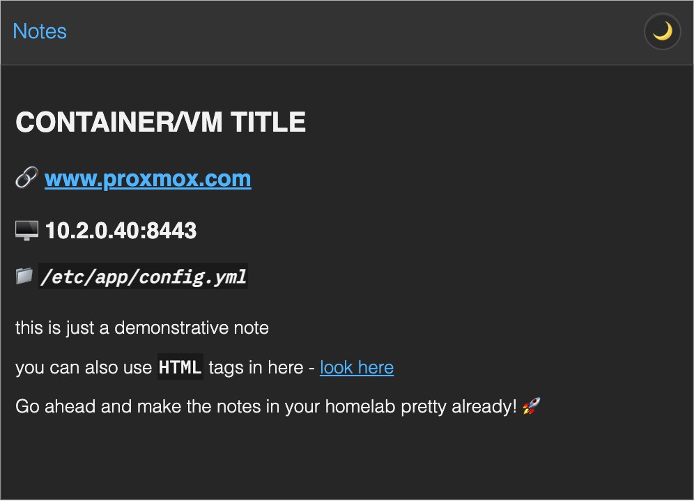
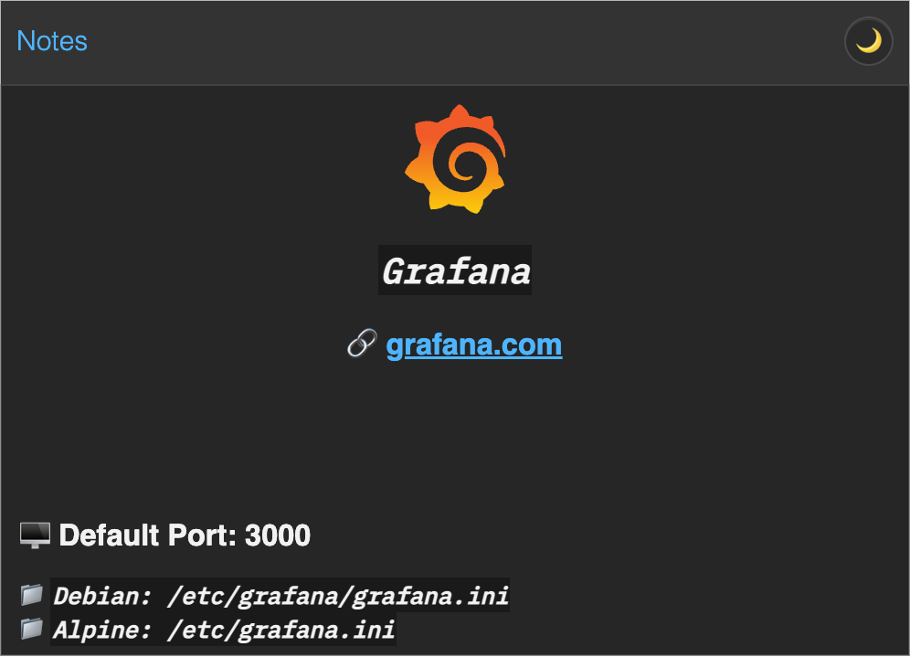
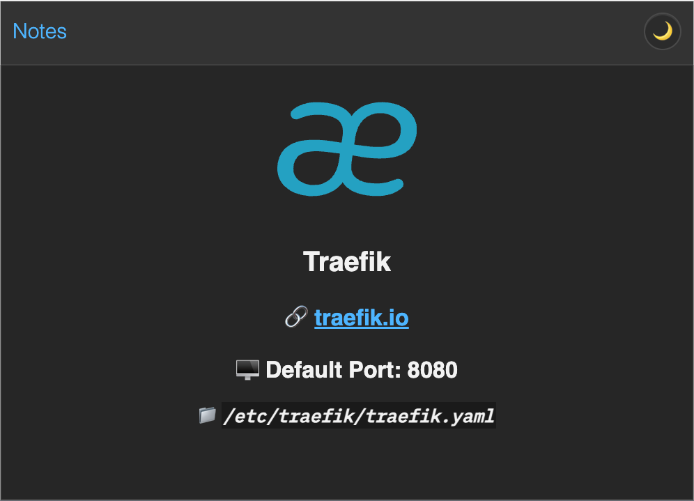
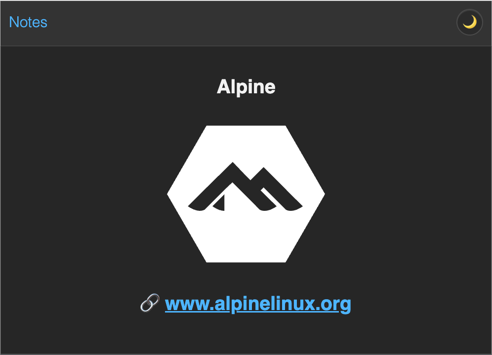
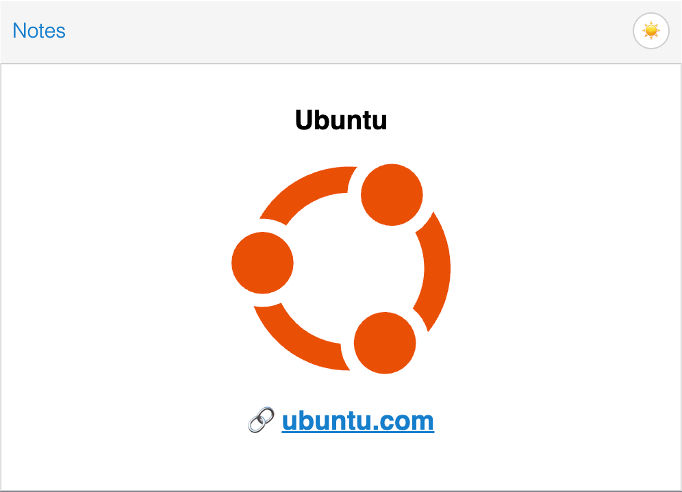
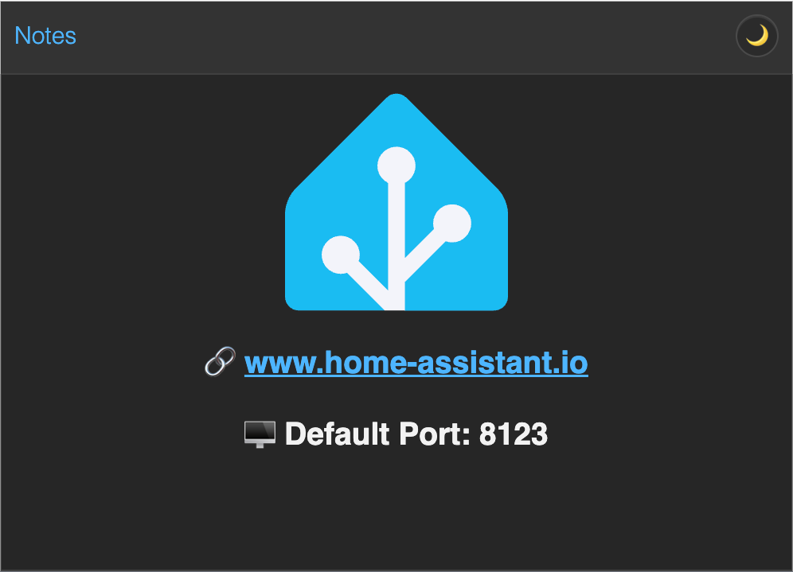
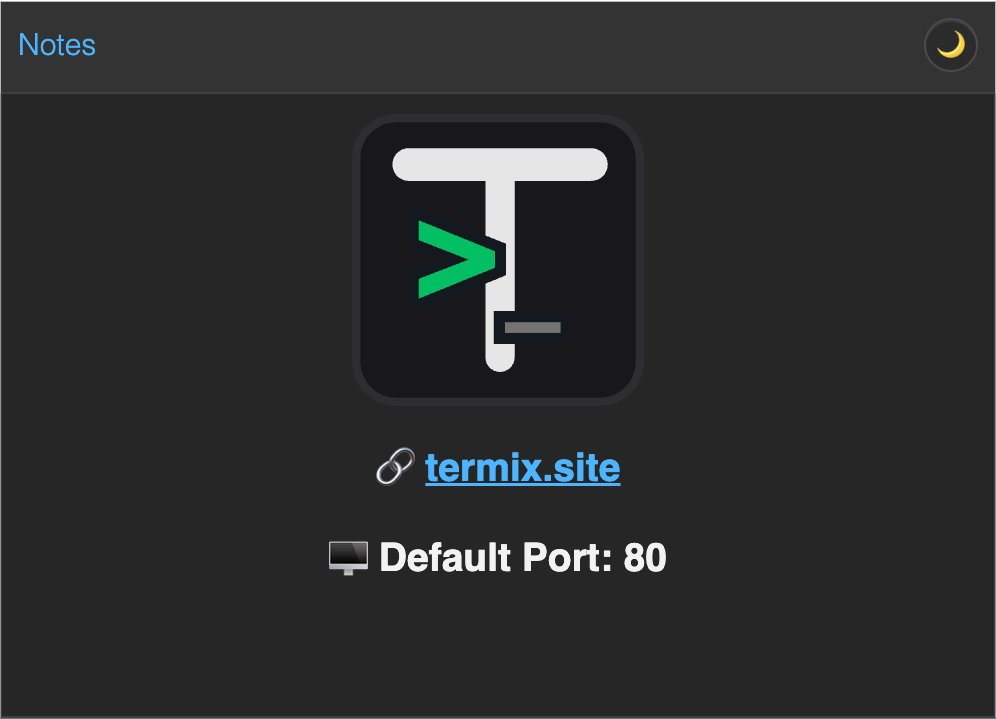
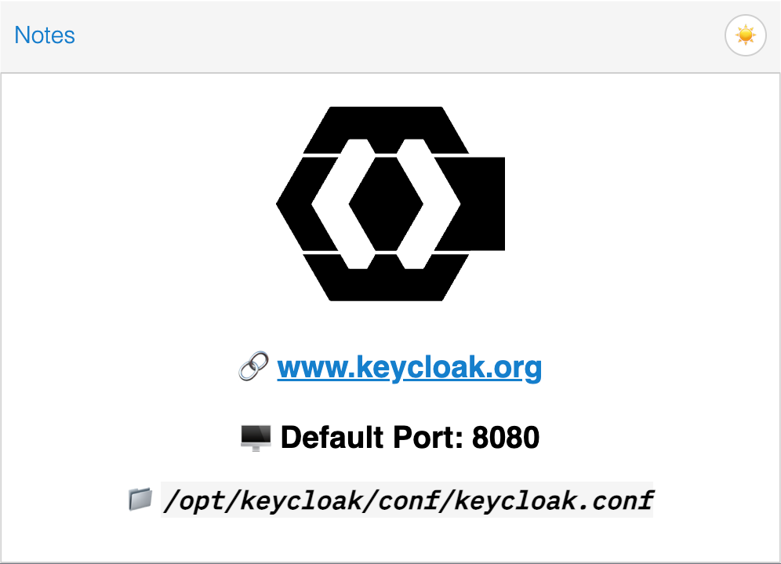

  
  <h1>PVE NoteBuddy</h1>
  
<em>Generate Pretty Proxmox Guest Notes with a Very Innovative Attractive Clean WEB Interface Tool that is a Excellent Enhancement for Proxmox to Enhance the Notes Section via a Simple WEB Based UI</em>

  

    
  

 **Search a Broad Palette of Templates for your Self-Hosted Services**  
 and adjust them to your liking or just start from scratch.

  🙌 <strong>Shoutout to</strong>
   
   
  
   
  <a href="https://github.com/community-scripts/ProxmoxVE">View on GitHub</a> • Used their Frontend .jsons to generate My Template Files
 
 
  
   
  <a href="https://github.com/selfhst/icons">View on GitHub</a> • Consistent, Beautiful Icons for 5000+ Self-Hosted Apps

 

# 🚀 Features

- Clean & Lightweight, Fully Client-Side App
- Direct HTML-Output Copy Button, ready to Paste to PVE Notes
- Preview Pane that Displays the Notes just like the PVE Web UI would (also supports Dark/Light Mode)
- Over 400 Templated Services (Logo, Website, Default Ports, Default Config Location)
- Directly Embed resizable SVGs from Local or External Sources (Fully Offline Available, No CDN Needed, Vector Quality)
- Option to resize External Images via **[wsrv.nl](https://wsrv.nl/)** (Open-Source, uses Cloudflare as CDN)
- Supports **[selfh.st](https://selfh.st/)** Icon Links natively, you can switch between their Icon variants directly from the UI
- Fields for things like Guest Name, FQDN, Networking & Config Paths
- Custom Note Field to use for Styling or to Input Additional Information (Supports **[Markdown](https://www.markdownguide.org/basic-syntax/)** HTML Tags)
- Alignment, Re-Order & Text Styling Options for every field, many possible Designs
- Import & Export to Save your Own Designs

# 🗒️ Examples

A collection of screenshots from the preview pane

<table align="center" style="width: 100%;">
  <tr>
    <td align="center" width="50%">
      
    </td>
    <td align="center" width="50%">
      
    </td>
  </tr>
  <tr>
    <td align="center" width="50%">
      
    </td>
    <td align="center" width="50%">
      
    </td>
  </tr>
  <tr>
    <td align="center" width="50%">
      
    </td>
    <td align="center" width="50%">
      
    </td>
  </tr>
  <tr>
    <td align="center" width="50%">
      
    </td>
    <td align="center" width="50%">
      
    </td>
  </tr>
</table>

## Crawl-Scripts

In the Crawl-Scripts Folder inside the Repo there are are 2 Scripts, one to Crawl Content from the **[community-scripts](https://github.com/community-scripts/ProxmoxVE)** Repo (crawl.mjs) and a Second Script (generate-templates.mjs) to transform the `.json` Files in their Repositoy into usable NoteBuddy `.json` Files. Thanks to their Curated Repo, I am able to provide over 400 Templates with Service Names and their Icons, Website Links, Default Ports & Default Config Locations. 

Massive shoutout to them! 🤝

The Crawl-Scripts are only needed to commit Template Updates to this Repo and are not used by NoteBuddy itself.

## Local Deployment

soon.

## Disclaimer

_The recent problems that erupted in the Technology Community with Vibe-Coded Apps, specifically regarding Security Issues are concerning. The App is Fully Client-Sided and No AI Client Side, there is No Backend and No AI Backend, No use of Telemetry Tracking + it's Hosted on GitHub Pages. I am definitely categorizing NoteBuddy as safe to visit & use. Still - I want to Disclose, that I had Assistance from an AI Agent to Create & Troubleshoot Parts of the Scripts inside this Repository. I used it to write the Parser for the the Final HTML Output, the SVG Embed Feature, the Scaling Feature, the handling of JSON Files for Import/Export as well as the Script for Template Creation. The `.html`, `.css`, as well as a portion of the `app.js` still includes a lot of Handwritten Code that took many hours and a lot of coffee. The Code has been thoroughly Reviewed and Tested by myself. Be aware, since I am a Hobbyist-Coder, My Skills and Knowledge are Limited, but My Decade Long Non-Pro Experience with HTML and JS is still significant._

