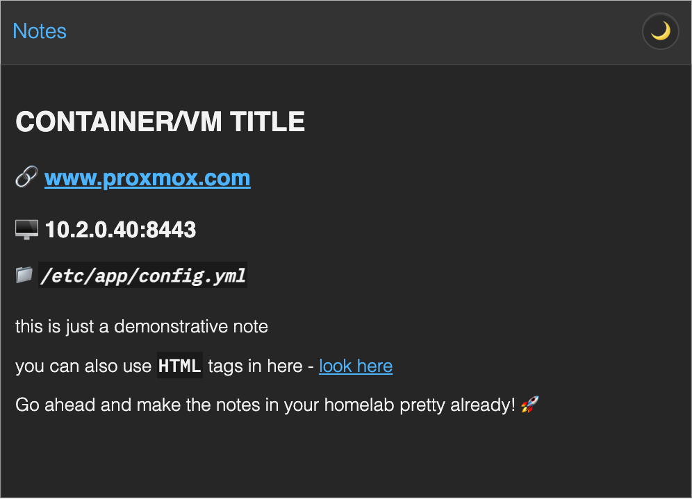
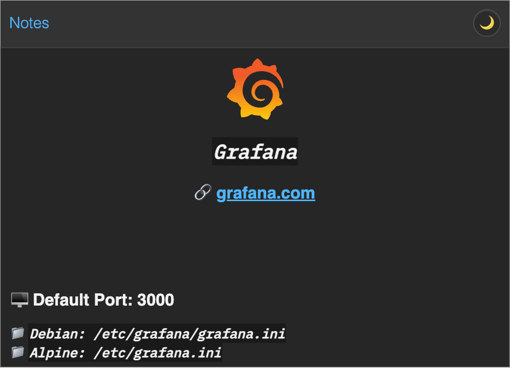
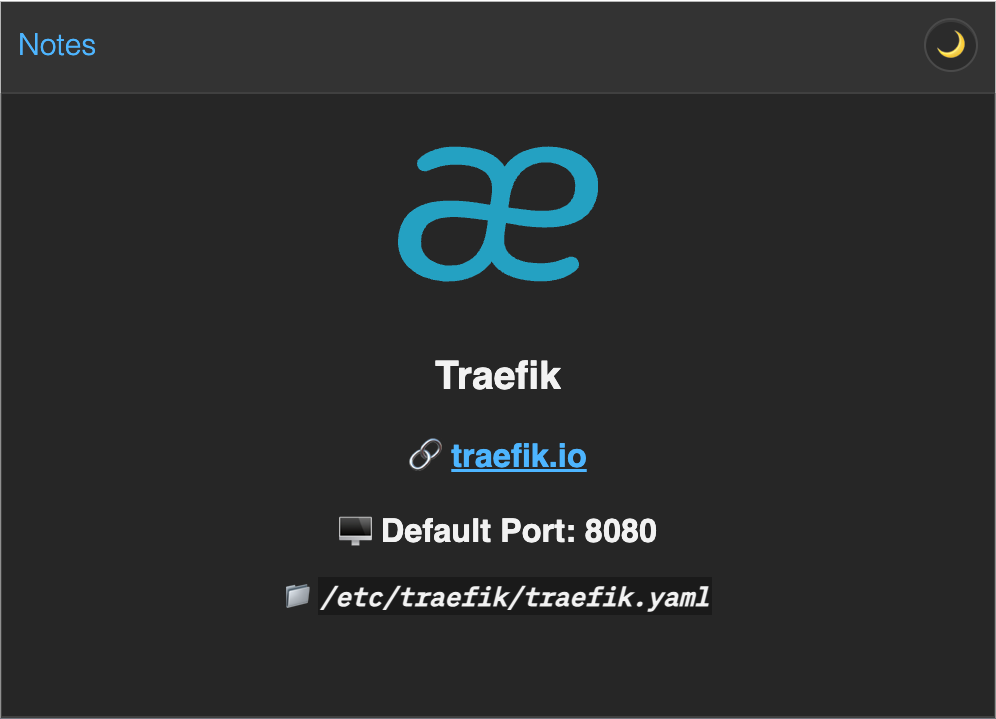
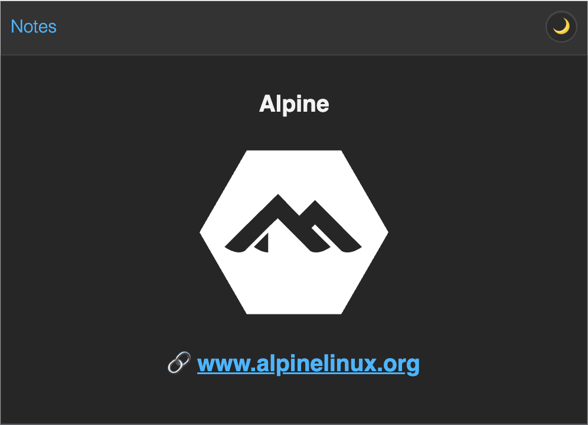
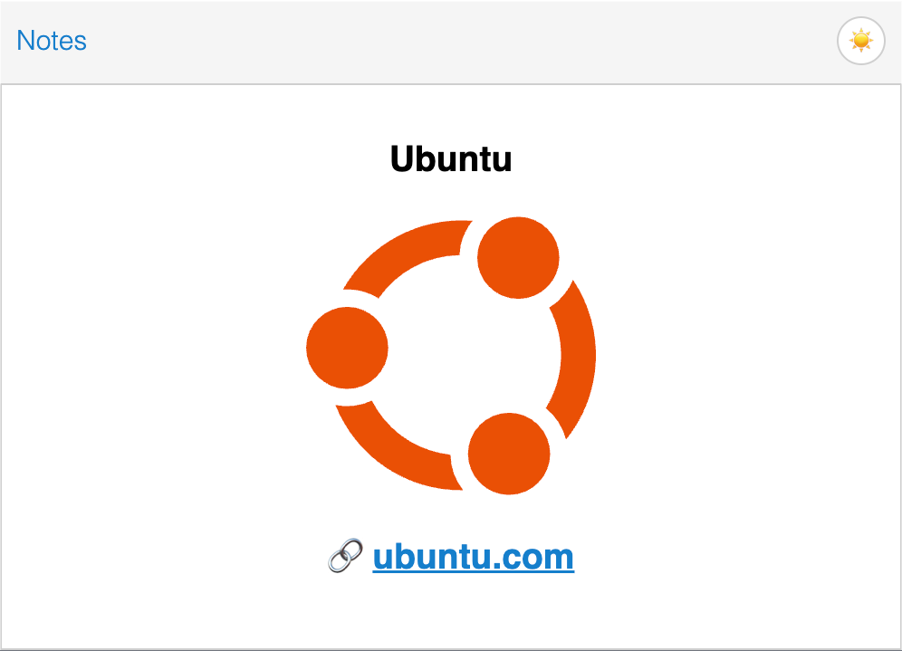
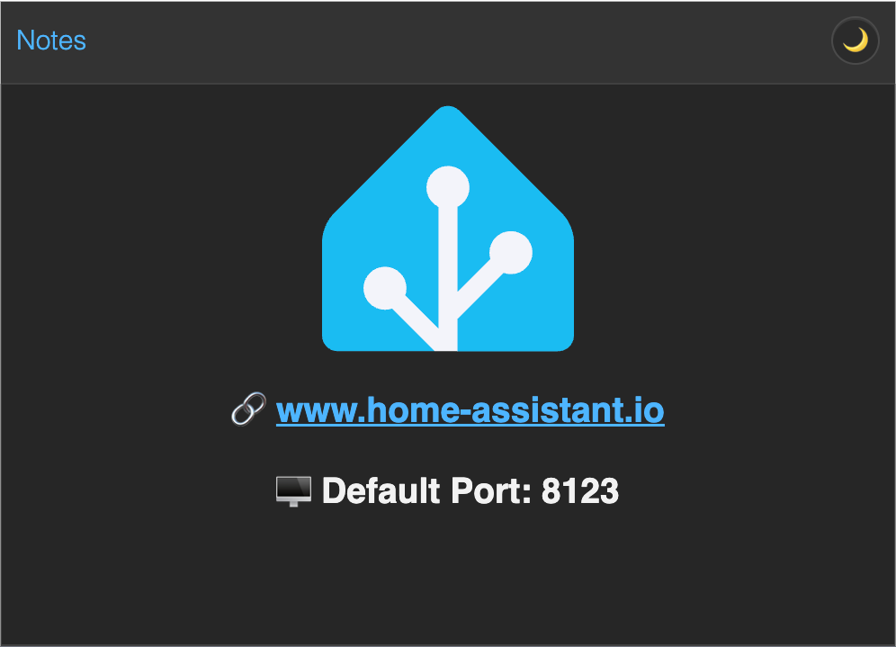
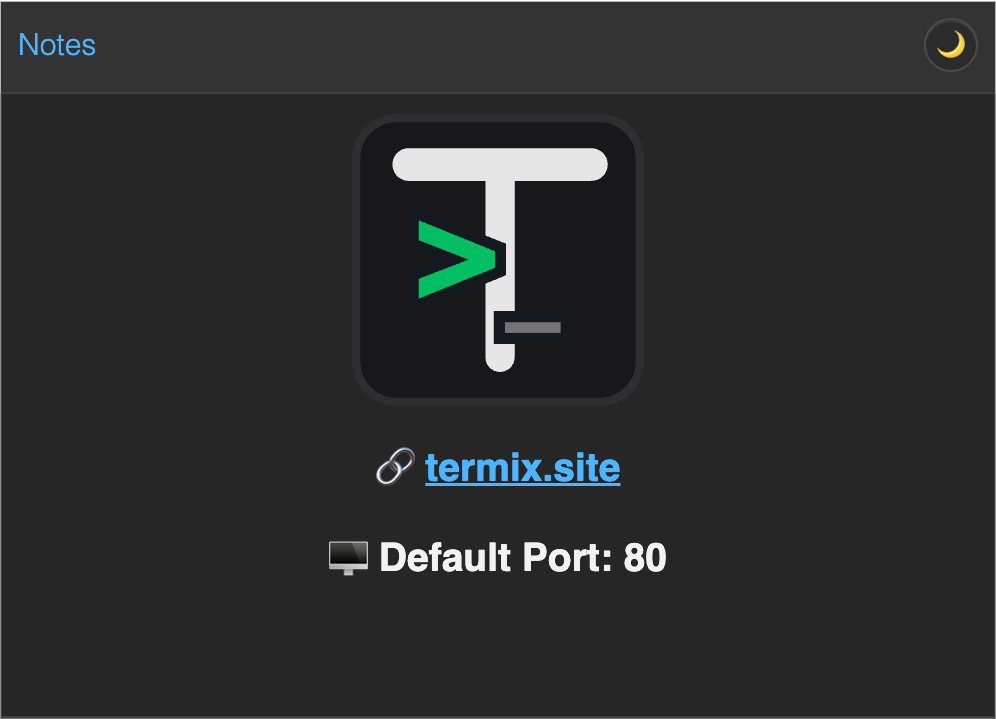
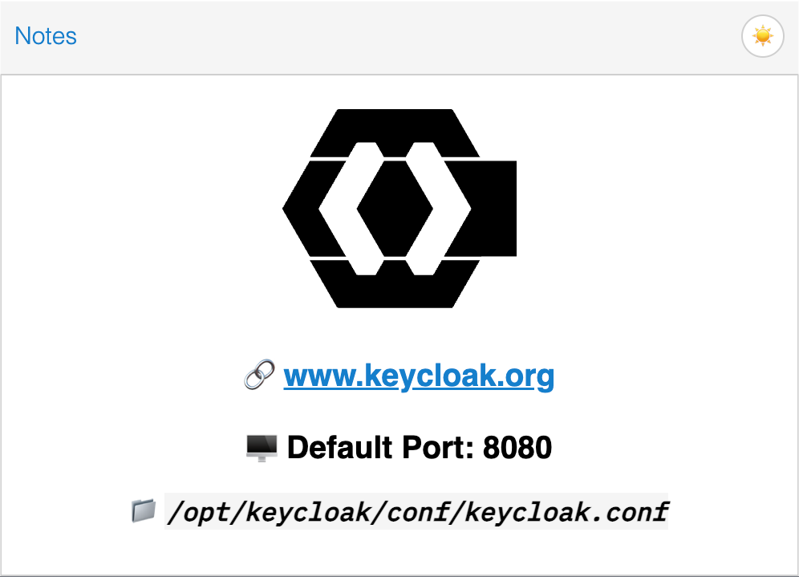

  
  <h1>PVE NoteBuddy</h1>
  
<em>Generate pretty Proxmox Guest Notes with a simple web based UI</em>

  

    
  

 

 **Use a broad palette of templates for your self-hosted services &**  
 **adjust them to your needs or create notes fully from scratch in a few seconds.**
 

  🙌 <strong>Shoutout to</strong>
   
   
  
   
  <a href="https://github.com/community-scripts/ProxmoxVE">View on GitHub</a> • Used their PocketBase DB to generate template files
 
 
  
   
  <a href="https://github.com/selfhst/icons">View on GitHub</a> • Consistent, beautiful icons for 5000+ self-hosted apps 
  Huge thanks for including NoteBuddy in the icon collection!

 

# 🚀 Features

- Clean & lightweight, fully client-side app
- Direct HTML-Output copy button, ready to paste to PVE Notes
- Preview pane that displays notes just like the PVE Web UI would (also supports dark/light mode)
- Over 400 templated services (Logo, Website, Default Ports, Default Config Location)
- Directly embed resizable SVGs from local or external sources (fully offline available, no CDN needed, vector quality)
- Option to resize external images via **[wsrv.nl](https://wsrv.nl/)** (Open-Source, uses Cloudflare as CDN)
- Supports **[selfh.st](https://selfh.st/)** icon links natively, you can switch between their icon variants directly from the UI
- Fields for thinks like guest name, FQDN, networking & config paths
- Custom Note field to use for styling or to input additional information (supports **[Markdown](https://www.markdownguide.org/basic-syntax/)** HTML tags)
- Alignment, re-order & text styling options for every field, many possible designs
- Import & export to save your own designs

# 🗒️ Examples

A collection of screenshots from the preview pane

      
      

      
      

      
      

      
      

## Local Deployment & Template Scripts

Please refer to the documentation.

## Frequently Asked: API & Automation

Currently API & Automation (e.g. automatic publishing to Proxmox or fetching the HTML Output with a GET Request) is not planned, since this would only weaken robustness and security. PVE NoteBuddy will remain separate from Proxmox or automation/deployment tools.

## AI Disclaimer & Security

This project leverages AI to assist with development. Code contributions generated or modified with the help of AI tools are thoroughly reviewed and tested by myself before release.

_PVE NoteBuddy is a fully client-side application with no backend & no telemetry. The live version is directly hosted on GitHub Pages. Based on its design and my own review, I consider it safe to use. Always be cautious about other distributed forks/clones that may contain malware. This project is actively maintained, there is no need to download or use it from another source._

## Project Statistics
<a href="https://www.star-history.com/?repos=JangaJones%2Fpve-notebuddy&type=date&legend=top-left">
 <picture>
   <source media="(prefers-color-scheme: dark)" srcset="https://api.star-history.com/chart?repos=JangaJones/pve-notebuddy&type=date&theme=dark&legend=top-left" />
   <source media="(prefers-color-scheme: light)" srcset="https://api.star-history.com/chart?repos=JangaJones/pve-notebuddy&type=date&legend=top-left" />
   
 </picture>
</a>